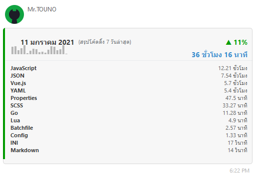
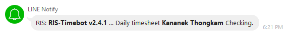
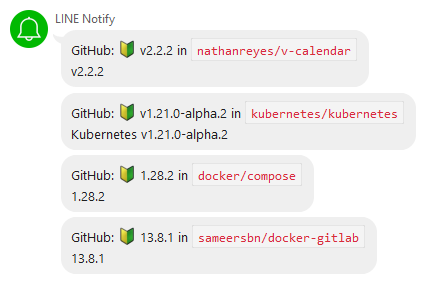

## Hi My name is Kananek Thongkam

Full-Stack Engineer & Opensource Developer
-------------------
  * 🌍  I'm based in Bangkok
  * 🖥️  See my portfolio at [My Resume](http://mr.touno.io/)
  * ✉️  You can contact me at [kananek.dev@touno.io](mailto:kananek.dev@touno.io)
  * 🧠  I'm learning Rustlang

This is the place where I opensource stuff and break things :rofl:

  * 🔭 I’m currently working on big something cool :wink:
  * 💬 Ask me about anything related to k8s,docker,nuxtjs,reactjs,deno,nodejs,golang,rustlang
  * 📫 How to reach me: [@dvgamerr](https://touno.io/s/8ae4)

### Skills

### Socials

      

-------------------------
#### Wakatime Dashboard

-------------------------
### My GitHub Stats

-------------------------

# Touno™ Project
โครงการที่เริ่มต้นขีันปี 2016 เพื่อเป็นเว็บและเครื่องมือที่คอยช่วยเหลือ ในทำงานต่างๆ
- [Discord](https://touno.io/s/ixj7)
- [GitHub](https://touno.io/s/l7cq)

## Current Project
- [gokub-bot](https://github.com/touno-io/gokub-bot) Bitkub Trading Bot.
- [go-bitkub](https://github.com/touno-io/bitkub-go) Bitkub API and WebSocket golang.

## Web API
- **mr.touno.io** deploy ไว้ที่ GithubPages ด้วย nuxt
- **blog.touno.io** deploy ไว้ที่ GithubPages ด้วย nuxt
- **notice.touno.io** deploy ไว้ที่ NAS-Synology ด้วย express+nuxt

### Task
- **ris-timesheet** ทำ timesheet ภายในบริษัท RIS เช็คทุกๆ วันหลัง 6 โมงเย็น `(รันไว้ที่ Github Actions)` 

- **task-wakatime** ดึงข้อมูลจาก wakatime เข้า mongodb เที่ยงคืนของทุกวัน `(รันไว้ที่ NAS-Synology)`

- **task-cinema** ดึงข้อมูล sf และ major เข้า mongodb ทุกๆ เช้า และแจ้งเตือนเข้าไลน์ทุกวันจันทร์ `(รันไว้ที่ NAS-Synology)`

- **task-notify** ดึงข้อมูล จากที่น่าสนใจต่างๆ มาแจ้งเตือนโดยตรง

## Tech/Framework used
- [Go Programming Language](https://golang.org/)
- [Nuxt.js - The Intuitive Vue Framework](https://nuxtjs.org/)

## API Reference
- [wakatime.com](https://wakatime.com/developers)
- [github.com](https://developer.github.com/v3/)

### Open source projects
- [line-notice](https://touno.io/s/684h)
- [exhentai-downloader](https://touno.io/s/whvg)
- [psp-library](https://touno.io/s/ddb0)

### Contacts

### License
MIT © 2021 Touno™
