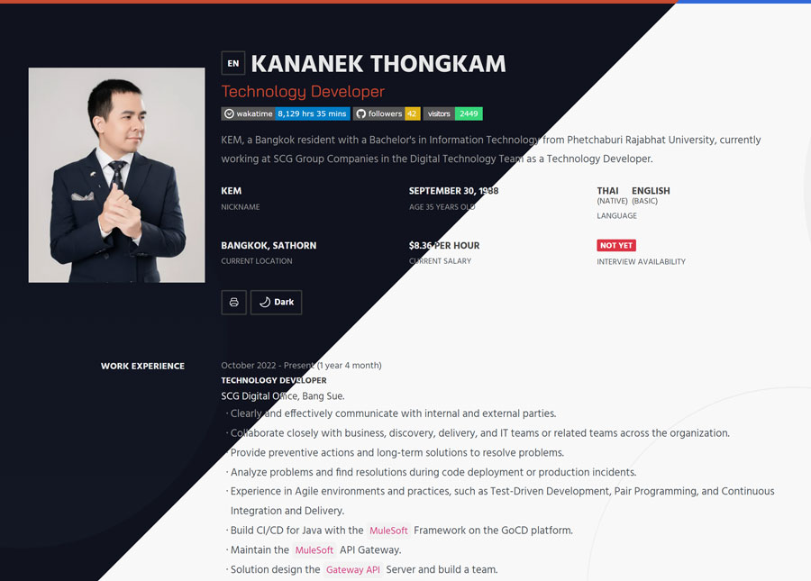

# dvgamerr.app — พอร์ตโฟลิโอสองภาษา (EN/TH) ที่โหลดไวมาก ⚡

<div align="center">

<p>เว็บส่วนตัวของ Kananek T. (Software Engineer) สร้างด้วย Astro 5 + TypeScript + Tailwind เน้นความไว การเข้าถึง (a11y) และ SEO ครบเครื่อง พร้อม PWA และ i18n ไทย/อังกฤษ</p>

<p>
  <a href="https://dvgamerr.app" title="Website status">
    
  </a>
  <a href="https://github.com/dvgamerr-app/dvgamerr-app.github.io/deployments" title="GitHub Pages deployments">
    
  </a>
  <a href="./LICENSE" title="License">
    
  </a>
  <br/>
  <a href="https://astro.build/" title="Astro">
    
  </a>
  <a href="https://www.typescriptlang.org/" title="TypeScript">
    
  </a>
  <a href="https://tailwindcss.com/" title="Tailwind CSS">
    
  </a>
  <a href="https://bun.sh/" title="Bun">
    
  </a>
  <a href="#" title="PWA Ready">
    
  </a>
  <a href="#" title="i18n EN/TH">
    
  </a>
  
</p>

<p>
  <a href="https://dvgamerr.app">เว็บไซต์จริง</a>
  · <a href="https://dvgamerr.app/">English version</a>
  · <a href="https://dvgamerr.app/th/">เวอร์ชันภาษาไทย</a>
</p>

<p>
  
</p>

</div>

---

## ทำไมเว็บนี้ถึง “ไว” และ “ครบ”

- Astro 5: ส่ง HTML ล้วนแบบ Islands — โหลดเร็วมากโดยไม่พา JS ส่วนเกินติดมาด้วย
- Tailwind CSS Utilities: ออกแบบให้สวยไวโดยไม่ต้องแบก CSS หนักๆ
- PWA พร้อมใช้งาน: เว็บแอปติดตั้งได้ ออฟไลน์ได้ (ผ่าน @vite-pwa/astro)
- SEO/Meta ครบ: sitemap, robots.txt, Open Graph พร้อมตั้งแต่แรก
- ภาพคม ชัด เร็ว: ใช้ astro:assets กับไฟล์ภาพที่เตรียมไว้ล่วงหน้า
- i18n 2 ภาษา: English/ไทย ด้วยโครงสร้างไฟล์ชัดเจน ใช้งานง่าย

---

## Quick Start

```shell
bun i
bun dev
```

## การเพิ่ม/แก้คอนเทนต์ (Authoring)

- Work timeline: `src/components/work/en|th/*.md`
- บทความ/บล็อก: `src/content/blogs/*.md` (กำหนดหน้าผ่าน `src/pages/posts/*.md`)
- สลับภาษา: โครงหน้าหลัก EN ที่ `src/pages/index.astro` และ TH ที่ `src/pages/th/index.astro`

---

## ลิขสิทธิ์และเครดิต

- ภาพ/ไอคอนบางส่วน: ดูที่ไฟล์/โฟลเดอร์ใน `public/` และ `src/assets/`
- Reference tools
  - https://mini-qr-code-generator.vercel.app/
  - https://iconscout.com/

License: โปรดดูที่ไฟล์ [LICENSE](./LICENSE)

—

Made with Astro & a lot of care. หากมีข้อเสนอแนะ/ไอเดีย PR ได้เลย หรือเปิด Issue มาพูดคุยกันครับ 🙌
