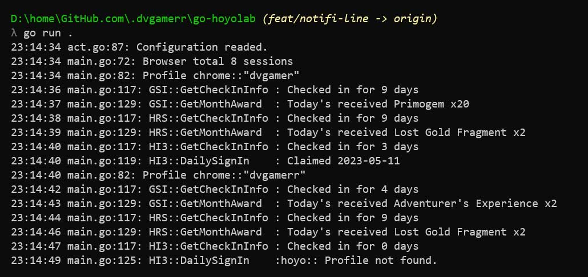

ช่วงนี้ผมไปเจอโปรแกรมตัวนึง ที่สายเกม Hoyoverse น่าจะชอบ เพราะมันช่วยให้การเช็กอินรับของประจำวัน ง่ายขึ้นเยอะ ไม่ต้องมานั่งเปิดเกมทุกวันให้เสียเวลา แถมยังแจ้งเตือนได้หลายช่องทางด้วย

## ฟีเจอร์หลัก ๆ ที่มีตอนนี้

- อัปเดตเวอร์ชันล่าสุดจาก GitHub ให้อัตโนมัติ
- เช็กอินรายวันผ่าน Chrome ได้เท่านั้น เพื่อความเสถียร
- รองรับหลาย Chrome Profiles ใช้ได้กับหลายไอดีเกม
- ใช้คำสั่งผ่าน command line ได้ทุกระบบปฏิบัติการ
- แจ้งเตือนผ่าน **Line Notify** หลังเช็กอินเสร็จ
- แจ้งเตือนผ่าน **Discord** หลังเช็กอินเสร็จ
- รองรับการเช็กอินเกม **Genshin Impact**, **Honkai Star Rail**, **Zenless Zone Zero**, และ **Honkai Impact 3**

## ฟีเจอร์ที่กำลังจะมา

- ใช้ใน Docker container ได้
- รองรับ session กับทุกเบราว์เซอร์
- ติดตั้ง schedule task อัตโนมัติบน Windows

พูดง่าย ๆ คือ ใครเล่นหลายเกม หลายไอดี และอยากให้ระบบช่วยจัดการเช็กอิน พร้อมแจ้งเตือนแบบครบ ๆ นี่คือตัวช่วยที่คุ้มมาก แค่ตั้งครั้งเดียว ก็ลืมเรื่องลืมเช็กอินไปได้เลย
